# Pose Anonymization

Remove identifying information from sign language poses

## Usage

```bash
pip install git+https://github.com/sign-language-processing/pose-anonymization
```

To anonymize a pose sequence:

```bash
anonymize_pose --input="example.pose" --output="example_anonymized.pose" [--appearance="specific_signer.pose"]
```

The `--appearance` option allows to transfer the pose sequence to a specific signer's appearance.
(This is useful for models trained on specific signers.)

In python:

```python
from pose_format import Pose

from pose_anonymization.appearance import remove_appearance

with open("example.pose", "rb") as f:
    pose = Pose.read(f.read())

anonymized_pose = remove_appearance(pose)
```

## Methods

### Appearance Based Anonymization (Naive)

Currently implemented in this repository.

Using the mean of sign language poses calculated by
[`sign-language-processing/sign-vq`](https://github.com/sign-language-processing/sign-vq),
we can anonymize a pose sequence by assuming the first frame is only the appearance of the person,
and remove it from the rest of the frames, then add the mean.

(Example generated using `./scripts/create_example.sh`, transferred to `assets/example/interpreter.pose`)

| Sign   | Original___                                   | Anonymized_                                     | Transferred                                      |
|--------|-----------------------------------------------|-------------------------------------------------|--------------------------------------------------| 
| Kleine |  | 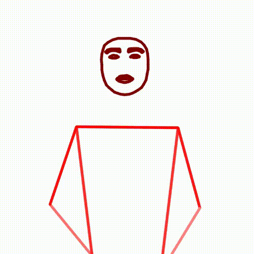 | 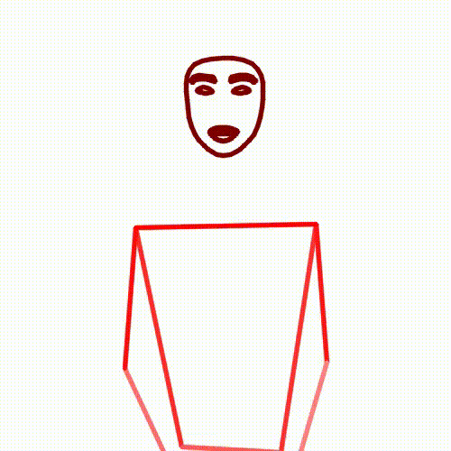 |
| Kinder | 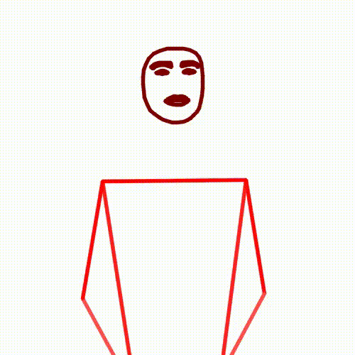 | 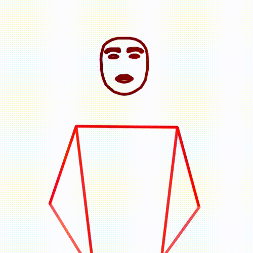 | 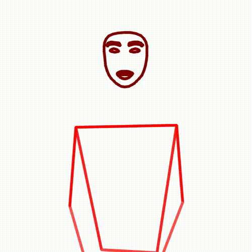 |
| Essen  | 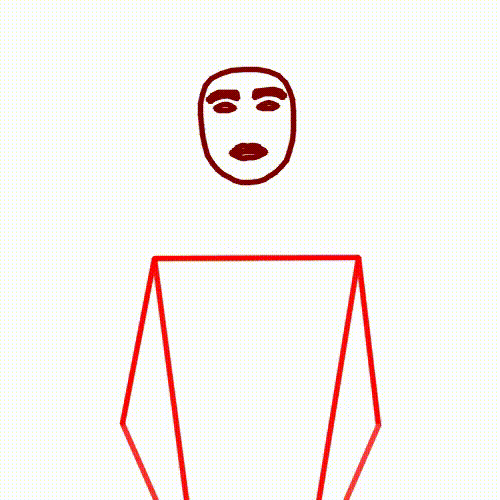   | 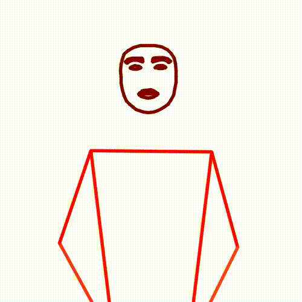   | 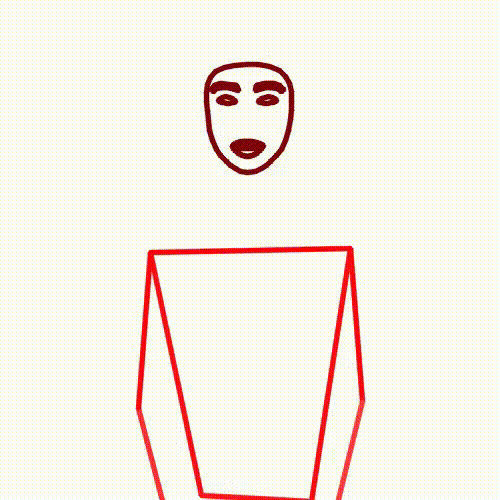   |
| Pizza  | 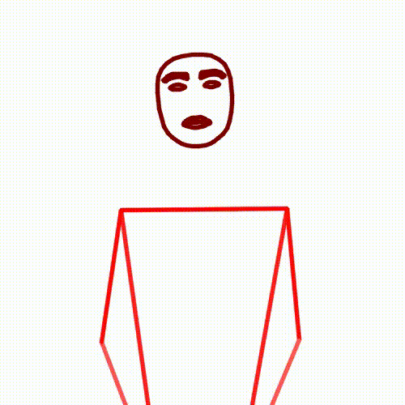   | 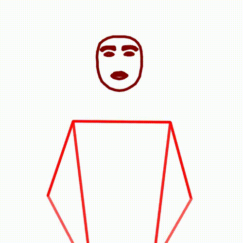   | 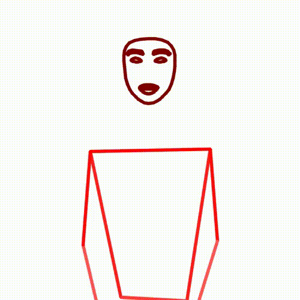   |

### Information Theoretic Perfect Anonymization

This is not yet implemented in this repository.

There exists identifying information in every sign language utterance.
From appearance, to prosody, movement pattern, and choice of signs.

Therefore, if we want to remove all identifying information, we need to remove all information.
However we can decide on a tradeoff between privacy and utility, and remove all information except for the choice of
signs.

Pipeline approach:

- [`sign-language-processing/segmentation`](https://github.com/sign-language-processing/segmentation) can be used to
  segment the pose into individual signs.
- [`sign-language-processing/signwriting-transcription`](https://github.com/sign-language-processing/signwriting-transcription)
  can be used to transcribe the individual signs into SignWriting.
- [`sign-language-processing/signwriting-animation`](https://github.com/sign-language-processing/signwriting-animation)
  can be used to animate the SignWriting back into poses.
- [`sign-language-processing/fluent-pose-synthesis`](https://github.com/sign-language-processing/fluent-pose-synthesis)
  can be used to synthesize fluent utterances from the anonymized poses.

This pipeline guarantees anonymization from an information theoretic perspective, as the only information that is
preserved is the choice of signs.

## Citing this work

```bibtex
@misc{moryossef2024anonymization, 
    title={pose-anonymization: Remove identifying information from sign language poses},
    author={Moryossef, Amit},
    howpublished={\url{https://github.com/sign-language-processing/pose-anonymization}},
    year={2024}
}
```
